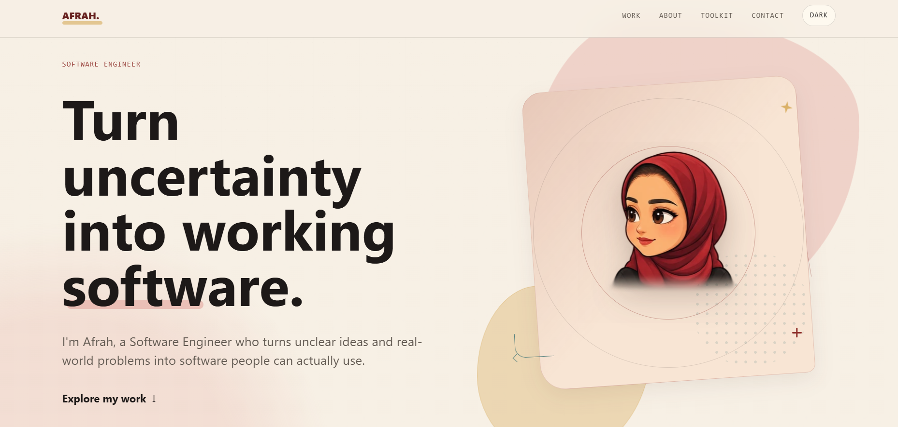
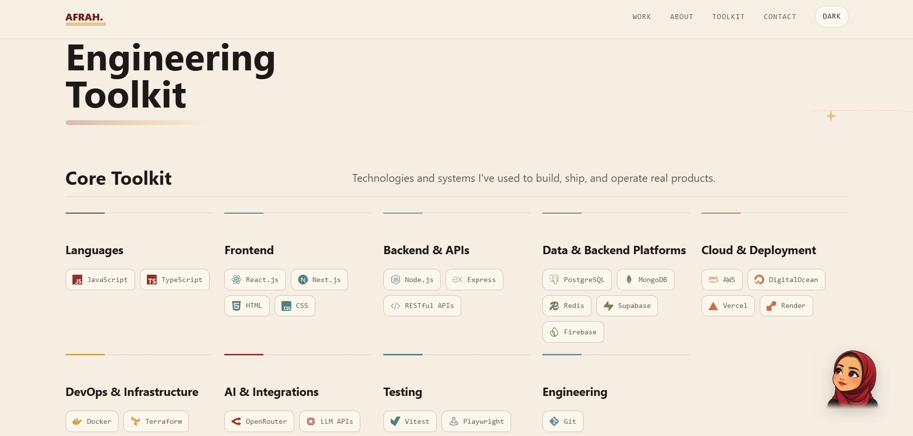

# Afrah Bawhab - Software Engineer Portfolio

Afrah Bawhab is a software engineer focused on turning unclear product ideas and real-world operational problems into usable software. This portfolio presents selected product work, case studies, earlier experiments, credentials, and the engineering judgment behind the projects.

[View Live Portfolio](https://afrah3b.github.io/) | [LinkedIn](https://www.linkedin.com/in/afrah-bawhab-0891a826a) | [GitHub](https://github.com/Afrah3B) | [Email](mailto:afrahbawhab@gmail.com)


## Portfolio Preview

[](https://afrah3b.github.io/)
[](https://afrah3b.github.io/)

[**View Live Portfolio**](https://afrah3b.github.io/)

## About This Portfolio

This is more than a digital resume. The site is designed as an interactive presentation of Afrah's engineering growth: complete products, case studies, earlier technical experiments, certificates, learning milestones, and the patterns behind how she approaches ambiguity, debugging, systems, and business context.

The homepage introduces the professional positioning, proof metrics, selected work, engineering journey, problem areas, principles, toolkit, earlier experiments, credentials, and contact flow. Deeper routes provide project archives, case-study narratives, and a credential timeline.

## Experience & Interaction Design

- **Interactive mascot journey:** The `page-mascot` portrait is rendered through `MascotJourney`, follows scroll progress from the hero area, travels with the viewport, docks into the About section, and adapts its scale for mobile layouts.
- **Motion with fallbacks:** Sections reveal through `IntersectionObserver`, while `prefers-reduced-motion` users get immediate visibility and non-animated scroll behavior.
- **Section-aware navigation:** The sticky navigation links to homepage sections, closes the mobile menu on route changes, and re-triggers hash scrolling when the user selects the current section again.
- **Route scroll management:** `ScrollManager` disables browser scroll restoration, scrolls to top on page changes, supports hash targets, and waits for delayed DOM targets with a `MutationObserver`.
- **Case-study storytelling:** Each case study combines role, type, timeline, logo, product visuals, core question, decisions, engineering stories, outcomes, and a next-project path.
- **Responsive archive views:** Selected work, project archives, credential timelines, galleries, and dialogs shift from multi-column desktop layouts to focused mobile layouts.
- **Theme support:** The app supports light, dark, and system-derived themes through CSS variables, local storage, an early inline theme script, and a navbar toggle.

## Selected Work

Detailed project content lives in `src/content/portfolio.ts`; the README keeps this intentionally concise so the website remains the source of truth.

| Project | Role | Period | Focus | Purpose |
| --- | --- | --- | --- | --- |
| Banan (`/work/banan`) | CTO / Software Engineer | Jan 2025 -> Present | Adaptive learning, AI, architecture, infrastructure | An EdTech platform that began with touch typing and expanded through use in schools into a broader learning experience. |
| LUD (`/work/lud`) | Software Engineer | Sep 2024 -> Present | Business systems, data, automation, integrations | An operations platform that grew from spreadsheet automation into software for restaurant workflows, reporting, and decision support. |
| Rooting (`/work/rooting`) | Software Engineer | Jan 2023 -> Aug 2024 | E-commerce, full stack, payments, cloud | Afrah's first complete e-commerce product, spanning the storefront, administration, backend, payments, delivery integrations, infrastructure, and deployment. |

The homepage also includes a proof strip with verified portfolio metrics from the content model: 300+ real users, 50+ clients served, and 3 products built from the ground up.

## Case Studies

The case-study system is implemented under `/work/:slug` for Banan, LUD, and Rooting. Each case study is backed by structured content and supports:

- Project branding through logo assets.
- Timeline data rendered from month/year date objects.
- Multiple product images with captions.
- A responsive gallery and modal lightbox.
- Keyboard navigation with Escape, ArrowRight, and ArrowLeft.
- Touch swipe navigation on mobile.
- Challenge, context, important decisions, engineering stories, outcomes, lessons, and next-project navigation.

This makes the portfolio useful for more than screenshot browsing: each project explains the product context and the engineering decisions behind it.

## Credentials & Certificate Archive

The credentials archive exists at `/archive` and is backed by `src/content/credentials.ts`.

It organizes records into:

- Academic
- Professional
- Courses & Programs
- Community & Volunteering

Credentials are sorted chronologically by issue date, grouped by year, filterable by category, and viewable in an accessible modal document viewer with focus return and Escape-to-close behavior. The homepage includes a smaller credential teaser, while the archive remains the full visual record.

## Earlier Experiments

The project archive at `/projects` is backed by `src/content/archiveProjects.ts`. It groups earlier work into four chapters:

| Chapter | What It Contains |
| --- | --- |
| Building Complete Products | Full-stack systems, dashboards, storefront/admin/backend work |
| Exploring Intelligent Systems | AI, NLP, dataset, and symbolic reasoning experiments |
| Applied Systems & Mobile | Reservation, pilgrim assistance, and operational systems |
| Design, Interaction & Creative Coding | Personal web, UI/UX, graphics, and interactive experiments |

Archive project pages support image and video media, technology tags, highlights, learning notes, and optional live or repository links when provided by the data.

## Engineering Highlights

- **Structured content model:** Profile data, selected projects, case studies, credentials, toolkit entries, and archive projects are organized in `src/content`, keeping portfolio content editable without rewriting page components.
- **Typed project dates:** `src/utils/projectDates.ts` formats date ranges, year ranges, and comparison values from structured month/year objects.
- **Reusable layout primitives:** `Layout`, `Section`, decorative primitives, media components, credential components, and archive components keep page implementations focused on content flow.
- **Routing architecture:** React Router defines homepage, selected case studies, archive pages, and credential archive routes in one entry point.
- **Accessible interaction patterns:** The code uses semantic sections, labelled navigation, aria labels, `aria-live` status messages, modal dialog roles, focus management, keyboard handlers, and visible focus styling.
- **Contact resilience:** The contact form validates required fields and email format, includes a honeypot field, handles sending/success/error states, and redacts EmailJS values from development error logs.
- **Performance-conscious media:** Images are lazy loaded where appropriate, the first case-study image is eager loaded, videos use metadata preload, static assets live under `public`, and mascot transforms use `requestAnimationFrame`.
- **Theme-first CSS:** Light and dark palettes are controlled by CSS custom properties, with an inline script preventing a late theme flash before React hydrates.

## Architecture

```text
src/
|-- App.tsx                    # Homepage composition
|-- main.tsx                   # Router and route definitions
|-- components/
|   |-- Layout.tsx             # Shared page shell and reveal observer
|   |-- Navbar.tsx             # Primary navigation and theme toggle
|   |-- ScrollManager.tsx      # Route and hash scroll behavior
|   |-- MascotJourney.tsx      # Scroll-positioned interactive mascot
|   |-- sections/              # Homepage sections
|   `-- credentials/           # Archive filters, timeline, viewer
|-- pages/                     # Case studies, project archive, credential archive
|-- content/                   # Portfolio, archive, credentials, toolkit data
|-- services/                  # EmailJS contact delivery
|-- config/                    # Environment-backed EmailJS config
|-- utils/                     # Metadata, dates, theme helpers
`-- styles/global.css          # Design system, responsive layout, themes
```

Static assets are stored in:

```text
public/
|-- assets/projects/           # Project and case-study media
|-- certificates/              # Certificate images
|-- mascots/                   # Mascot sprite sheets
|-- favicon.svg
|-- robots.txt
`-- sitemap.xml
```

## Tech Stack

| Area | Technology |
| --- | --- |
| Frontend | React 19, TypeScript |
| Build Tooling | Vite 5, TypeScript compiler |
| Routing | React Router DOM 7 |
| Styling | Custom CSS, CSS variables, responsive media queries |
| Icons | React Icons |
| Mascot | `page-mascot` |
| Contact | EmailJS browser SDK |
| Static Assets | Public project images, videos, certificates, mascot WebP sprites |
| Deployment | GitHub Pages, static production build via `vite build` |

## Design Principles

- **Personality without losing clarity:** The mascot, editorial copy, and visual rhythm give the portfolio a personal voice while keeping navigation and content structure direct.
- **Motion with purpose:** Scroll movement, reveal effects, hover states, and galleries support orientation and storytelling rather than replacing content.
- **Content before decoration:** Projects and case studies emphasize product context, decisions, outcomes, and lessons.
- **Responsive by default:** Layouts adapt across homepage sections, archives, galleries, dialogs, and navigation.
- **Professional growth as a system:** Earlier experiments, credentials, selected work, and principles show how the engineering practice evolved over time.

## Local Development

Use npm, which is the package manager represented by `package-lock.json`.

```bash
npm install
npm run dev
```

Production build:

```bash
npm run build
npm run preview
```

EmailJS contact delivery is configured with Vite environment variables:

```env
VITE_EMAILJS_SERVICE_ID=
VITE_EMAILJS_TEMPLATE_ID=
VITE_EMAILJS_PUBLIC_KEY=
```

When these values are missing in development, the app warns that contact delivery is disabled. Do not commit real service values.

## Deployment

The project builds as a static Vite app with:

```bash
npm run build
```

The production portfolio is published on GitHub Pages at [afrah3b.github.io](https://afrah3b.github.io/). The app is compiled into a static production bundle with Vite; `public/robots.txt` and `public/sitemap.xml` provide crawler metadata.

## Professional Links

- Portfolio: [afrah3b.github.io](https://afrah3b.github.io/)
- LinkedIn: [afrah-bawhab-0891a826a](https://www.linkedin.com/in/afrah-bawhab-0891a826a)
- GitHub: [Afrah3B](https://github.com/Afrah3B)
- Email: [afrahbawhab@gmail.com](mailto:afrahbawhab@gmail.com)

## Repository Notes

- Main source of truth for project and case-study content: `src/content/portfolio.ts`
- Main source of truth for credential records: `src/content/credentials.ts`
- Main source of truth for earlier archive projects: `src/content/archiveProjects.ts`
- Portfolio preview image: `public/portfolio-preview.png`
- Live deployment: [afrah3b.github.io](https://afrah3b.github.io/)
